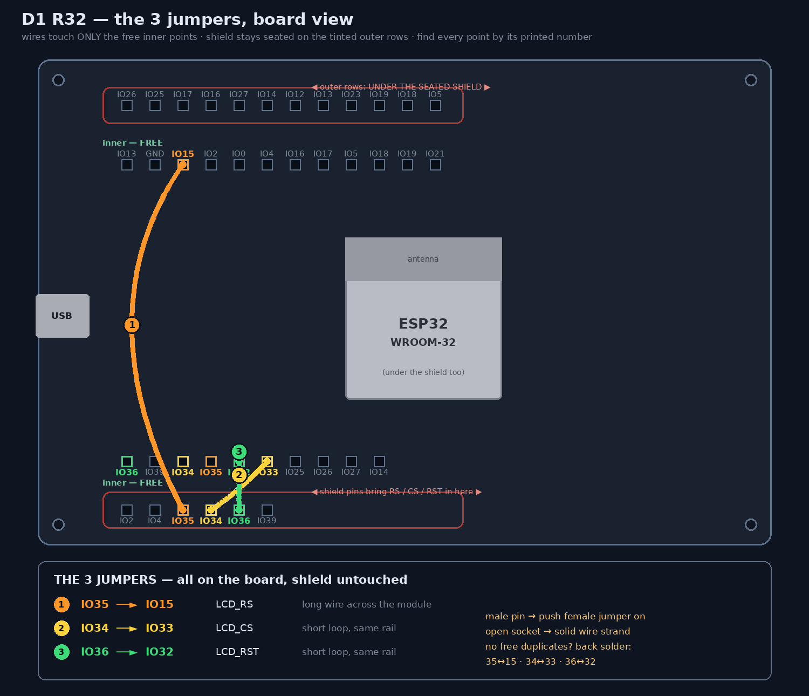
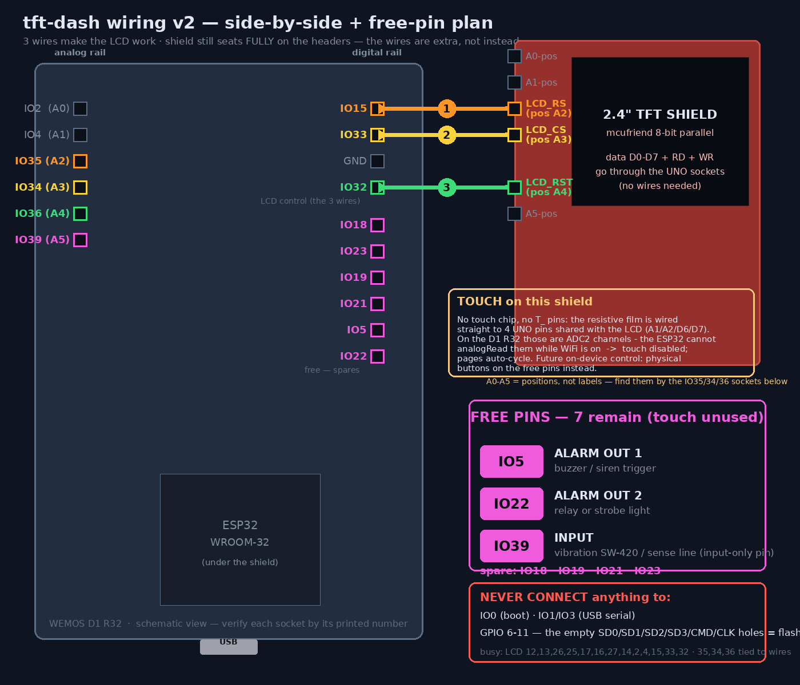

# tft-dash wiring — WEMOS D1 R32 + 2.4" UNO TFT touch shield




**v2 architecture (2026-10-01): Bluetooth pod.** The module runs with
**WiFi off** in normal operation — that's what makes the shield's
resistive touch usable (the film sits on ADC2 pins, which the WiFi driver
locks). It connects over **Bluetooth Classic SPP to the votol-bt-bridge**
(`VOTOL-BT`, the same link the VOTOL phone app uses) and speaks the VOTOL
protocol itself (SHOW telemetry poll — ported from `webapp/app.py`), so no
laptop/webapp is needed at the bike. WiFi (and OTA) exists only during a
**30 s window after every boot**. Touch bring-up/calibration runs over
USB serial: `v` variant, `s`/`f`/`g` swap/flip axes, `w` save to NVS,
`r` raw dump, `p` send SHOW.

The display pod for the esp-votol system. It shows live telemetry from
the controller and (phase 2) the keyless panel, driven by touch. It never
writes to the controller — the SHOW poll is LOCAL mode (0xAA), observe
only.

```
                 ┌────────────────────────────┐
   VOTOL ──UART──│ bridge ESP32  "VOTOL-BT"   │
 controller      │  (also TCP 6638 for webapp)│
                 └───────┬────────────▲───────┘
              BT Classic │SPP         │ WiFi (unaffected)
                         │            │
              ┌──────────┴────────────┴───────┐      phone dashboard /
              │  tft-dash (D1 R32 + TFT)      │◄──── webapp keep using
              │  WiFi OFF · touch ON · OTA    │      the same webapp
              │  only in a 30 s boot window   │
              └───────────────────────────────┘
```

## 1. Why 3 jumper wires are required (read this first)

The shield is the common **8-bit parallel UNO shield** (mcufriend family —
the listing's pin table with `LCD_RD/LCD_WR + D0–D7` is this type). Its
lines land on the UNO header like this:

| Shield signal | UNO pin | D1 R32 GPIO | Usable straight through? |
|---|---|---|---|
| data D0–D7    | D8,D9,D2…D7 | 12,13,26,25,17,16,27,14 | **yes** |
| LCD_RD        | A0 | **2**  | **yes** |
| LCD_WR        | A1 | **4**  | **yes** |
| LCD_RS        | A2 | 35 | **no — input-only GPIO** |
| LCD_CS        | A3 | 34 | **no — input-only GPIO** |
| LCD_RST       | A4 | 36 | **no — input-only GPIO** |

The ESP32 GPIOs behind the D1 R32's A2–A5 header positions (34/35/36/39)
are **input-only** — they can never drive the shield's RS/CS/RST control
lines. This is exactly why MCUFRIEND_kbv's official D1-R32 support puts
those three lines on other GPIOs instead. Cross-confirmed by three
sources: the [arduino-esp32 `d1_uno32` variant](https://github.com/espressif/arduino-esp32/blob/2.0.16/variants/d1_uno32/pins_arduino.h)
(A2=35, A3=34, A4=36, A5=39), the [MCUFRIEND_kbv ESP32 pin block](https://github.com/prenticedavid/MCUFRIEND_kbv/blob/master/utility/mcufriend_shield.h),
and [Bodmer's TFT_eSPI discussion #2299](https://github.com/Bodmer/TFT_eSPI/discussions/2299)
— same D1 R32 + same 2.4" parallel shield, Bodmer: *"some of the GPIO are
input only, wires need to be added and the correct output pin used."* His
example mapping (CS=33, DC=15, RST=32, WR=4, RD=2) is the same set we use.

**The mod — 3 female-to-female jumper wires, non-destructive, no cutting:**

| From (shield's stacking socket on top) | To (D1 R32 pin, read the silk) |
|---|---|
| **A2** (LCD_RS) | pin labeled **IO15** (may read `15` / `TX2`) |
| **A3** (LCD_CS) | pin labeled **IO33** |
| **A4** (LCD_RST)| pin labeled **IO32** |

Seat the shield fully on the UNO headers, then plug the three jumpers into
the shield's pass-through sockets at A2/A3/A4 and into the D1 R32 pins
silkscreened 15 / 33 / 32 (they sit on the same edge headers — your board
prints `IO32`, `IO33`, `IO15`, `IO2`, … along the header row).

> **Clone boards that print GPIO numbers instead of A0–A5** (like ours):
> the analog rail reads `IO2, IO4, IO35, IO34, IO36, IO39` — those are
> A0–A5. So the three wires are, by the printed numbers:
> **35→15, 34→33, 36→32** (socket to socket).
> Never connect anything to the empty through-holes labeled
> `SD3/CMD/CLK/SD0/SD1` — that's the flash chip's bus.

> **"My shield has no A2/A3/A4 labels" — normal.** They are UNO standard
> *positions*, rarely printed on the shield. Identify them by the D1 R32's
> own silkscreen: the shield pin plugged into the socket printed **35 IS
> A2**, into **34 = A3**, into **36 = A4**.

> **Preferred: board-only jumpers** (`wiring-board-jumpers.png`) — don't
> touch the shield at all. The shield's pins seated in the covered outer
> sockets 35/34/36 already deliver RS/CS/RST onto the board, and the free
> inner-rail points with the **same printed numbers are the same nets**.
> So the three wires run entirely on the D1 R32:
> **35→15 (RS) · 34→33 (CS) · 36→32 (RST)**, shield untouched and fully
> seated. If a point is a male pin, push the female jumper on; if an open
> socket, use a solid wire strand; if your clone has no free duplicate
> 35/34/36, fall back to back-side solder pads below.

> **Shield-side hook-up** (alternative): where to hook the wire depends on
> what the shield exposes on top:
> 1. stacking pass-through **sockets** on top → female jumper into the
>    socket at that position (easiest);
> 2. male pins **protruding** on top of the shield PCB → female jumper
>    pushed onto the protruding pin at that position;
> 3. neither → **solder version (always works):** on the BACK of the
>    D1 R32, wire the solder pads: pad-of-socket-35 ↔ pad-of-socket-15,
>    34 ↔ 33, 36 ↔ 32. Because the shield's pins sit inside those
>    sockets, the shield's RS/CS/RST signals are already present on the
>    board-side pads — the shield itself never needs to be touched.

Notes:
- GPIO2 = LCD_RD and is also the on-board LED — the LED may flicker when
  the display is read. Normal. **Never use GPIO2 as an LED in this project.**
- The A2/A3/A4 sockets still connect to GPIO35/34/36 on the PCB — those see
  the RS/CS/RST signals now. Don't try to use GPIO 34/35/36 for anything.
- If the screen stays white/black after this, run the diagnose firmware (§4)
  and check the serial output before suspecting the code.

### No female–female jumpers at hand?

Every socket involved is female, so male–male or male–female jumpers won't
fit. Improvisations that work in 2.54 mm sockets:
- **a strand from a Cat5e/ethernet cable** — cut ~8 cm of one wire, it's
  0.5 mm single-core: push one bare end into the A2 socket, the other into
  IO15. Stiff enough to hold contact.
- cut & straightened **resistor legs**.
- or just buy a Dupont **female-to-female** pack (a few thousand rupiah).

Without any of these, the only test possible today is **seating the shield
and checking the backlight glows** (proves seating + 5V) — the LCD itself
cannot answer until the three control lines are connected, because the
chip inside the shield is literally never told "a command is coming".

## 2. Power

- **Bench:** USB into the D1 R32. That's it — the shield takes 5V and 3V3
  from the headers. Backlight draws ~100 mA, well within USB.
- **On the bike later:** 5V from a DC-DC buck (battery 72V → 5V) into the
  **5V pin** of the power header. **Never USB and bike-5V at the same time**
  (same rule as the bridge ESP32).

## 3. Touch — settled empirically: NOT usable on this build (keep WiFi)

Probe results on our shield (2026-10-01): **no XPT2046 chip, no `T_` pin
row.** The resistive film is wired straight to 4 UNO pins **shared with
the LCD** (classic mcufriend: A1/A2/D6/D7 — measured: nothing answers on
the SPI sockets D10–D13 either; `src/touchprobe.cpp`, env
`votol-dash-touchprobe`, keeps the evidence).

Why we don't use it: reading that film = analog reads, and on the D1 R32
those pins are **ADC2 channels (GPIO 4/27/14) — the ESP32 cannot read
ADC2 while WiFi is active** (the WiFi driver owns ADC2). WiFi is this
module's whole job, so touch stays disabled: `TOUCH_CS_PIN 0` in
`src/main.cpp`, pages **auto-cycle every 7 s**, control happens from the
phone/web dashboard. Future on-device control: **3 physical buttons on
IO5/IO22/IO39** — cheaper and more reliable than the film.

## 4. Bring-up order — COMPLETED 2026-10-01 ✅

1. ~~diagnose firmware~~ — LCD ID **0x9341 (ILI9341)** confirmed live.
2. ~~3 jumpers~~ — done, board-only (35→15, 34→33, 36→32 on the inner
   rails); color bars + test screen verified on hardware.
3. ~~full chip erase~~ — done (fixed the leftover-firmware NVS warning:
   `pio run -e votol-dash -t erase` before first flash of this module).
4. ~~real firmware~~ — flashed, joined WiFi as **192.168.1.17**, mDNS
   `votol-dash.local`, polls the webapp at 192.168.1.55:8080
   (verified `pollOk` climbing, `lastHttp 200`, live 120.1 V on screen).

Module endpoints: `/state.json` (page, poll stats, RSSI), `/sethost?host=…&port=…`
(persisted in NVS), `/reboot`. OTA:
`pio run -e votol-dash-ota -t upload --upload-port votol-dash.local`.

## 5. Screens (3 fat tabs — easier touch)

- **TELE** — three panes; **tap the content** to page through them
  (header shows `VOTOL RIDE/ELEC/MOTOR`):
  - **RIDE** — one huge number: **km/h** once the wheel circumference is
    set (serial `c <metres>`, e.g. `c 2.05`; km/h = rpm × circ × 0.06),
    until then big **motor rpm**. Battery V + current in a strip below.
  - **ELEC** — battery V (big), current, computed power, gear.
  - **MOTOR** — RPM (big), gear, controller/motor temps.
  - Shared bottom: controller status + fault code, BT rx/tx/age link line.
    The dot top-right: green = frames < 5 s old, yellow = stale, red = bad.
  - **Auto behavior** (no page cycling between tabs anymore): riding
    (rpm ≥ 50 for 2 s) locks the page to TELE + RIDE; parked, it rotates
    ELEC ↔ MOTOR every 8 s.
- **LOCK** — ARMED/DISARMED hero (semantic red/green, not themeable),
  fob presence + RSSI, PANIC/STOP siren button (manual 30 s wail —
  armed only; tap STOP or any tap to silence). Every arm/disarm
  transition plays a short padlock animation (red lock closes + "ARMED"
  / green lock opens with a sonar ping + "DISARMED"); preview over
  serial with `a` (arm) / `A` (disarm).
- **SYS** — two sub-tabs at the top of the page:
  - **STATUS** — BT link state + rx/tx, touch raw values, uptime/heap,
    wheel-calibration line, "release BT for phone" button.
  - **CONFIG** — text size **S/M/L** (default M — smaller than the
    original build), **value color** and **accent color** swatches
    (6 colors). Selections apply live and auto-save to NVS. Fit
    guarantee: long values (e.g. 120.1 V) auto-shrink a size so nothing
    ever overflows the layout.

## 5b. Display power — follows the registered iTag

- **No fob registered** → display always on (you can never be locked out).
- **Fob registered** (NVS `fob`): display **on while the iTag is near**
  (BLE sighting within 12 s), **off** when it leaves or is switched off —
  **from the very first boot second** (the WiFi/OTA window runs headless:
  reset with the fob away = dark screen while OTA still answers on
  `votol-dash.local`; bring the iTag near, even mid-window, and it wakes). Sleep = black fill (NOT panel DISPOFF: the hardwired backlight
  shines through an undriven panel as WHITE — known mcufriend quirk);
  wake redraws instantly. Register/replace the fob via serial
  (`i` scan, `f <mac>` set, `m` learn by name, `M` clear) or the webapp
  debug endpoint during the boot window. Serial `d` = 2-minute
  display-on override for bench work. True backlight cutoff needs a
  transistor on the LED supply (future hardware mod).

## 6. Pin budget after LCD (touch unused)

Occupied — LCD (13): data `12,13,26,25,17,16,27,14` · RD `2` (also the
on-board LED) · WR `4` · RS `15` / CS `33` / RST `32` (the 3 jumpers).
The input-only pins `35/34/36` sit on the jumper nets — unusable for
anything else.

Never use: `0` (boot strap), `1/3` (USB serial), GPIO `6–11` (flash bus —
the empty `SD0/SD1/SD2/SD3/CMD/CLK` holes).

Still free — **7 pins** (touch disabled, see §3): **GPIO5, GPIO22, GPIO39**
(input-only/ADC) allocated to the future alarm add-on —

| Pin | Future job |
|---|---|
| **GPIO5** (`IO5`, UNO D10) | **alarm out 1** — buzzer / siren trigger |
| **GPIO22** (`IO22`) | **alarm out 2** — relay or strobe light |
| **GPIO39** (`IO39`, the A5 position) | **input** — vibration SW-420 / sense line (input-only pin) |

Plus **spares 18/19/21/23** (kept free by not using touch). Confirmed by
the [ElectroPeak guide](https://electropeak.com/learn/interfacing-2-4-inch-tft-lcd-display-shield-with-arduino/)
for this exact shield family (ILI9341, 8-bit parallel): *"A5, and digital
pins D10, D11, D12, D13 — if SD card is not in use — are free"* — we don't
use the SD slot, so **D10–D13 = GPIO 5/23/19/18 and A5 = GPIO 39 are all
ours** (the guide also uses the Adafruit TouchScreen library = 4-wire
resistive film on shared analog pins, corroborating §3). These can host
3 physical page/confirm buttons later — or the SD slot could come back
(SPI on 18/23/19 + CS on GPIO5, but that spends the alarm-out-1 pin:
pick either SD logging **or** the alarm add-on).

Future fork: the shield's SD slot can share the touch SPI bus
(CLK 18 / MOSI 23 / MISO 19) with its own CS on GPIO5 — but that spends
the last full GPIO. Pick either SD logging **or** the alarm/I2C plan, not both.

## 7. Troubleshooting

| Symptom | Cause / fix |
|---|---|
| White screen, serial says `LCD ID: 0x0000 NONE` | 3 jumpers missing/wrong, or shield not fully seated |
| Bars show but wrong colors (e.g. red↔blue) | controller is a different chip — note the ID the diag prints and tell me |
| Display works, no updates | WiFi failed (SYS page shows IP `no wifi`) or wrong webapp host (`/sethost`) |
| `poll ok:0 fail:n http:0` | webapp not running / unreachable IP |
| Touch taps do nothing | run diag, recalibrate/swap `TS_LEFT…` values |
| Boot loops when GPIO0/IO0 jumpered | IO0 is a boot-strap pin — don't use it for jumpers |
